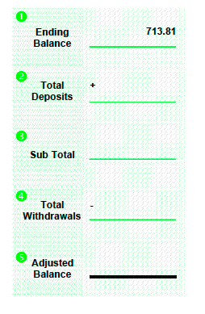
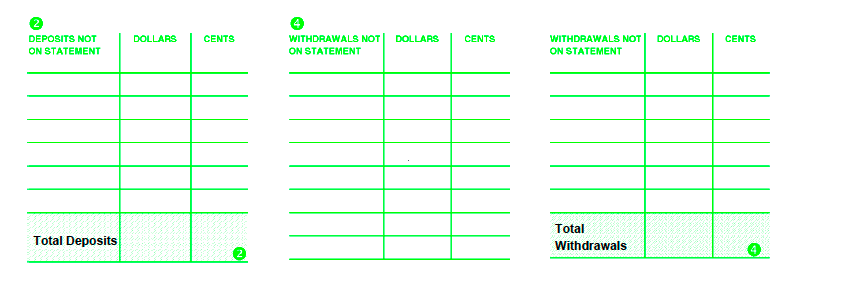

= How to Balance your Account
TD BANK <tdshinfo@tdbank.com>
:description: How to balance your checking account
:icons: font

[NOTE]
====
Begin by adjusting your account register as follows:
[unordered]
* Subtract any service charges shown on this statement.
* Subtract any automatic payments, transfers, or other electronic withdrawals not previously recorded.
* Add any interest earned if you have an interest-bearing account.
* Add any automatic deposits, withdrawals, or other electronic deposits not previously recorded.
* Review all withdrawals shown on this statement and check them off in your account register.
* Subtract the total of the withdrawals from the total of the deposits. This adjusted balance should equal your account balance.
* Follow instructions 2-5 to verify your ending account balance.
====

== Steps to balance a checking account

> _refer to the diagram "balance book" in instructions_

[ordered]
1. Your ending balance shown on this statement is as follows: `Ending 713.81`
2. List below the amount of deposits or credit transfers which do not appear on this statement. Total the deposits and enter on line 2.
3. Subtotal by adding lines 1 and 2.
4. List below the total amount of withdrawals that do not appear on this statement. Total the withdrawals and enter on line 4.
5. Subtract line 4 from 3. This adjusted balance should equal your account balance.

> _Use the grid below to record your transactions._

